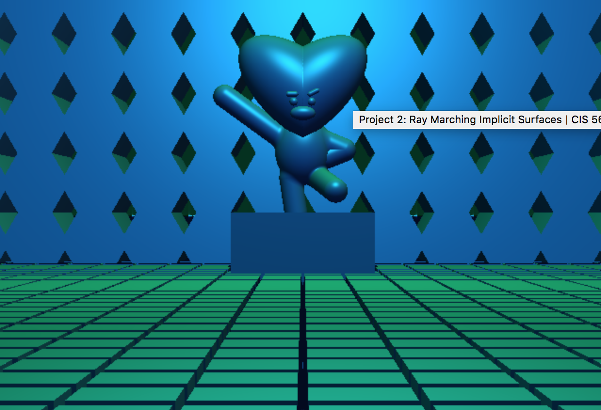

## Write-Up

1. Created a rayTracer with camera pos to rayMarch.
2. Created a normal estimator depending on the ray marcher.
3. TATA was created with 
    * union, intersection, subtraction, smooth blend operations
4. Floor
    * Domain repetition of cubes
5. BackDrop
    * Domain repetition of hexagons
6. Parts that animate in interesting ways
    * The character can stretch like Luffy from One Piece
7. A background that isn't a constant color
    * In addition to light source, used a cosine color palette that changes with a strict sine curve

ScreenShot: 

- [link to github](https://sangeun44.github.io/BT21/)

External Source:
- [Jamie Wong](http://jamie-wong.com/2016/07/15/ray-marching-signed-distance-functions/)
- [real-time subsurface scattering approximation](https://colinbarrebrisebois.com/2011/03/07/gdc-2011-approximating-translucency-for-a-fast-cheap-and-convincing-subsurface-scattering-look/).
- [IQ SDF](http://www.iquilezles.org/www/articles/distfunctions/distfunctions.htm)
- [Lecture slides](https://docs.google.com/presentation/d/1W5KWvkT1tscRG8x5tSfKXBRx9EGTZ-jVsOhIlfhJQLQ/edit?usp=sharing) (see the last two slides)
